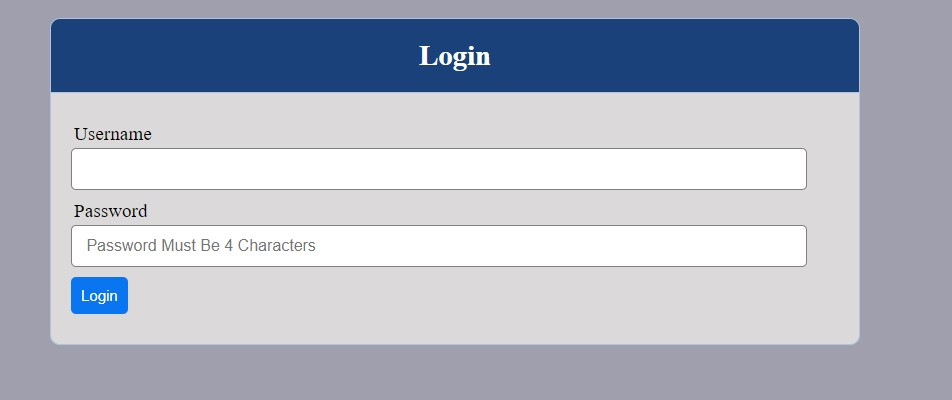

# Project-10
# CONFIGURE NGINX AS A LOAD BALANCER #

AIM OF THE PROJECT: By configuring a Nginx Load Balancer solution and implementing HTTPS protocol to enable safe communications between clients and web servers, this project seeks to increase the knowledge of a DevOps engineer. In order to prevent Man-In-The-Middle (MITM) attacks, an encrypted session will be established between the browser and the web server using SSL/TLS cryptographic protocols. Websites will be verified and identified via SSL/TLS digital certificates, with Let's Encrypt being a suggested Certificate Authority. The issue of certificates will be automated using the shell client cetrbot.

Below is a diagram of the solution's architecture:

FIRST STEP: Setup nginx

Give an EC2 server built on Ubuntu server 20.04 LTS a name.

NOTE: To facilitate connectivity, make sure that your instance security group has port 443 for HTTPS and port 80 for HTTP open.

Update your server by launching it from your terminal.
`sudo apt update`
Open the `/etc/hosts` file to update it with your server 1 and 2 private ip addresses
`sudo vi /etc/hosts` and save.

Install nginx with

`sudo apt install nginx -y`

`sudo systemctl enable nginx`

Check if nginx is up and running with `sudo systemctl status nginx.`

Step 2: Register a domain name

To get a valid SSL certificate, register a domain with any domain registrar of your choice e.g Godaddy, Domain, Bluehost, e.t.c

Register a new domain name in any domain zone. For example, `.com,` `.net,` `.org,` `.edu e.t.c`

Go back to your AWS console and search for "Route 53" and click on "create hosted zone"

After hosted zone has been created, for our "Route 53" to be connected to our domain you will copy each line of the cycled part in the image below into the each line of the Nameserver on your domain name and save.

The next thing is to create record but before doing that you need to create an "Elastic IP" and to do that you need to click on Elastic IP

Click on "Allocate Elasstic IP Address"

Ensure that you select the available zone of the instance you want to associate your Elastic IP with.
Click on "Allocate" and check the hosted zone you created and click on action and select Associate Elastic IP Address

Then, choose the server you want to link the Elastic IP with (ngins server) and click allocate.

Copy the Elastic IP address and go back to the "Route 53" where you have your created "hosted zone" and click on "Create Record".

Enter the Elastic IP address into "value" box and enter "www" into "Record name" box and then click on "Add another record" and paste in the Elastic IP address into "value" box and then click create record.

Now go back to your nginx server on your terminal.

Step 3: Configure Nginx as a Load Balancer

Configure nginx as load balancer using the web servers name used in the `/etc/hosts` file

To configure nginx, open the configuration file with `sudo vi /etc/nginx/nginx.conf` and add the script below to the "http" section of the file.

Look for this line include `/etc/nginx/sites-enabled/*;` and comment it by adding # to the beginning.

Ensure that you replace "www.domain.com" with the domain name you just created.

Restart the nginx server and check the status:

sudo systemctl restart nginx

sudo systemctl status nginx

Check that your webservers can be reached from browser with the domain name you have created using HTTP protocol http://www.<your-domain-name>

If your configuration is okay, you should see something like this

